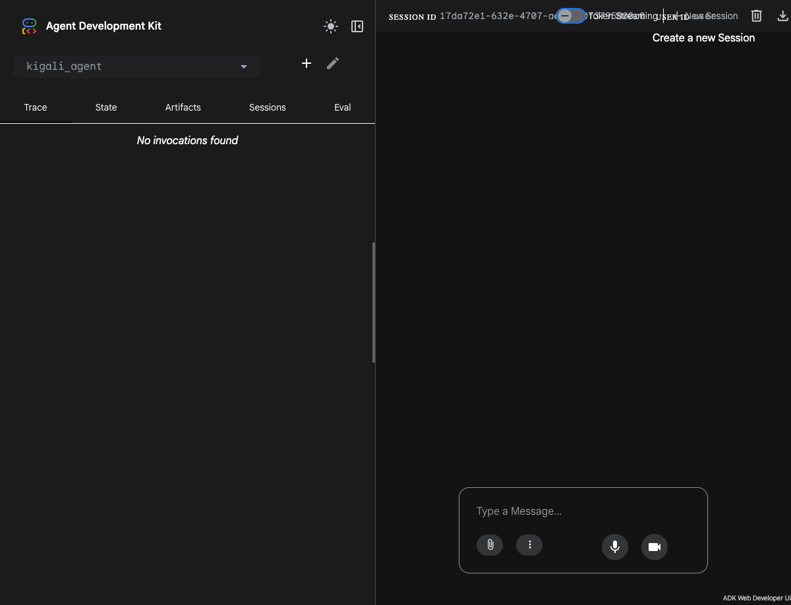
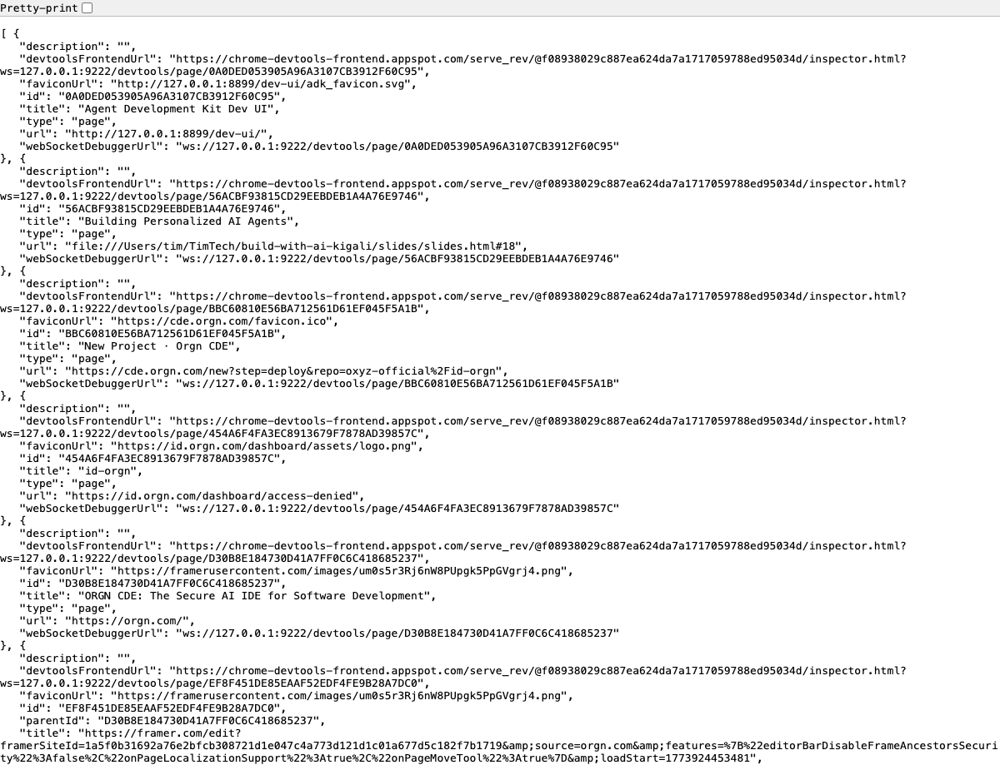

<!-- _backgroundImage: linear-gradient(135deg, #e8f0fe 0%, #d2e3fc 50%, #c6f6d5 100%) -->
<!-- _paginate: false -->

# Building Personalized AI Agents
# with Gemini, ADK, and MCP

**Timothy Olaleke**
Google Developer Expert — Cloud

*GDG Kigali — Build with AI: Study Jam #1*
*March 20, 2026*

---

# Agenda

| # | Topic | Time |
|---|-------|------|
| 1 | What are personalized agents? | 5 min |
| 2 | Google ADK overview | 10 min |
| 3 | Build your first agent (code) | 10 min |
| 4 | Custom tools | 10 min |
| 5 | Chrome CDP — browser control | 15 min |
| 6 | MCP & integrations | 5 min |
| 7 | Deployment | 5 min |
| 8 | Exercises & Q&A | remaining |

---

# What if your AI assistant...

- Knew **your browser tabs**?
- Could **click buttons** and **fill forms** for you?
- Could **search the web** with your context?
- Could **remember** your preferences across sessions?

Today, you'll build exactly that.

---

# What We're Building

### Three levels, one toolkit

| | What | How |
|---|------|-----|
| 1 | A personalized AI assistant | **10 lines of Python** |
| 2 | An agent that controls your browser | **ADK + Chrome CDP** |
| 3 | Deploy your agent | **One command** |

All **free**. All **open source**. No credit card needed.

---

# Chatbot vs. Personalized Agent

### A chatbot gives generic answers

You ask: *"What's a good restaurant?"*
It responds with a generic list from training data.

### A personalized agent knows YOUR context

You ask: *"What's a good restaurant?"*
It checks your **location**, your **calendar** (are you free tonight?),
your **dietary preferences**, and gives you a real answer.

---

# How ADK Makes This Possible

- **Custom tools** — wrap any Python function
- **Sessions** — remembers within conversations
- **MCP** — connects to your existing tools
- **Chrome CDP** — sees and controls your real browser

> Your tools. Your data. Your browser. Your preferences.

---

<!-- _backgroundImage: linear-gradient(135deg, #e8f0fe 0%, #d2e3fc 100%) -->

# Meet Google ADK

**Agent Development Kit** — the complete toolkit for AI agents

---

# ADK at a Glance

| Feature | Description |
|---------|-------------|
| **Code-first** | Agents are Python objects, not prompt chains |
| **Visual Builder** | No-code drag-and-drop creation |
| **50+ integrations** | Google Search, GitHub, Stripe, BigQuery... |
| **MCP support** | Connect any tool, consume or expose |
| **Sessions** | Persistent conversations with memory |
| **v1.26** | Production-stable, used at scale |

```bash
pip install google-adk
```

*Available in Python, TypeScript, and Java — fully open source*

---

# ADK vs. The Rest

| Feature | ADK | LangChain | CrewAI |
|---------|:---:|:---------:|:------:|
| Visual Builder | **Yes** | — | — |
| Free Gemini access | **Yes** | — | — |
| Browser control | **Yes** | — | — |
| MCP (bidirectional) | **Yes** | Partial | — |
| Agent-to-Agent (A2A) | **Yes** | — | — |
| Built-in Web UI | **Yes** | — | — |

**ADK is a complete platform, not just a library.**

---

# Setup — 2 Minutes

### Step 1: Install

```bash
pip install google-adk
```

### Step 2: Free API key

Go to **aistudio.google.com/apikey** — sign in with Gmail, create key.

### Step 3: Set it

```bash
export GOOGLE_API_KEY="your_key_here"
```

---

# Verify Your Setup

### Step 4: Launch the Visual Builder

```bash
adk web --port 8000
```

Open **http://localhost:8000** in your browser.

If you see the ADK interface — you're ready!

---

# Visual Builder — Zero Code

> **▶ LIVE DEMO** — `./run.sh 1`

```bash
adk web --port 8000
```

1. Click **+** to create an agent
2. Pick **Gemini 2.5 Flash** as the model
3. Write instructions in plain English
4. Add tools from the catalog
5. Test it live in the chat panel



---

# Your First Agent — 10 Lines

```python
from google.adk.agents import Agent
from google.adk.tools import google_search

root_agent = Agent(
    name="kigali_ai",
    model="gemini-2.5-flash",
    instruction=(
        "You are a helpful AI assistant for entrepreneurs "
        "in Kigali. Use Google Search for current data. "
        "You speak English, French, and Kinyarwanda."
    ),
    tools=[google_search],
)
```

---

# Run Your Agent

> **▶ LIVE DEMO** — `./run.sh 2`

### File structure

```
kigali_agent/
  __init__.py     # from . import agent
  agent.py        # The code from previous slide
  .env            # GOOGLE_API_KEY=your_key
```

### Run it

```bash
adk run kigali_agent
```

### Try these prompts:
- *"What is the population of Kigali?"*
- *"What's the mobile money market size in Rwanda?"*
- *"Who are the top tech companies in Kigali?"*

---

<!-- _backgroundImage: linear-gradient(135deg, #e8f0fe 0%, #d2e3fc 100%) -->

# Custom Tools
## Make your agent truly personal

---

# Any Python Function = A Tool

ADK reads the **docstring** and **type hints** automatically.

```python
def convert_currency(amount: float, from_cur: str, to_cur: str) -> dict:
    """Convert between currencies using live exchange rates."""
    url = f"https://open.er-api.com/v6/latest/{from_cur}"
    data = json.loads(urllib.request.urlopen(url).read())
    rate = data["rates"][to_cur.upper()]
    return {"converted": round(amount * rate, 2), "rate": rate}
```

Add it to your agent:

```python
tools=[convert_currency, calculate_business_metrics]
```

*"Convert 500 USD to RWF" — and it just works.*

---

# Another Custom Tool Example

```python
def calculate_business_metrics(
    revenue: float, costs: float, num_customers: int
) -> dict:
    """Calculate key business metrics from basic inputs."""
    profit = revenue - costs
    margin = (profit / revenue * 100) if revenue > 0 else 0
    rpc = revenue / num_customers if num_customers > 0 else 0
    health = "Healthy" if margin > 20 else "Needs attention"
    return {
        "profit": round(profit, 2),
        "margin_percent": round(margin, 1),
        "revenue_per_customer": round(rpc, 2),
        "health": health,
    }
```

*"I have revenue of 50000 USD, costs of 35000, and 200 customers. How's my business?"*

---

# Rules for Custom Tools

1. Use **type hints** for all parameters
2. Write a **clear docstring** — ADK uses it to decide when to call the tool
3. Return a **dict** — ADK converts it for the model
4. Keep functions **simple and focused** — one tool = one job

```python
# The agent decides WHEN to call each tool
root_agent = Agent(
    name="kigali_ai",
    model="gemini-2.5-flash",
    instruction="You are a business assistant for Kigali entrepreneurs.",
    tools=[convert_currency, calculate_business_metrics],
)
```

---

<!-- _backgroundImage: linear-gradient(135deg, #e8f0fe 0%, #c6f6d5 100%) -->

# The Highlight

## Give Your AI Eyes and Hands

### Chrome DevTools Protocol (CDP)

---

# What is Chrome CDP?

Chrome has a **built-in remote control API**.

Every Chrome browser. Already installed. Free.

```bash
# Start Chrome with debugging enabled
google-chrome --remote-debugging-port=9222
```

Your AI agent can now control Chrome programmatically.

---

# What Can CDP Do?

| Action | How |
|--------|-----|
| List open tabs | `GET /json/list` |
| Open a new tab | `PUT /json/new?url` |
| Run JavaScript | WebSocket + `Runtime.evaluate` |
| Take screenshots | WebSocket + `Page.captureScreenshot` |
| Click elements | WebSocket + JS injection |

---

# CDP in Action

Just visit `http://localhost:9222/json/list` and you get all your tabs as JSON:



---

# Why CDP is a Game-Changer

> *"Give your AI agent eyes and hands in the browser"*
> — Addy Osmani, Google Chrome team

### Before CDP:
Your agent generates code **blindly** — it can't see the result.

### With CDP:
Your agent can **see the page**, **interact with it**, and **verify** what happened.

---

# The Closed Loop

```
Generate → Execute → Observe → Fix → Repeat
```

This is what makes browser agents powerful:

1. Agent decides to open a URL
2. Chrome actually opens it
3. Agent reads what's on the page
4. Agent decides the next action based on what it sees
5. Repeat until the task is done

Google launched **Chrome DevTools MCP** — an official MCP server with **29 browser tools**. This is the direction Google is investing in.

---

# Browser Agent — The Code

```python
root_agent = Agent(
    name="browser_agent",
    model="gemini-2.5-flash",
    instruction="You control Chrome via CDP. Be concise.",
    tools=[
        list_tabs,        # See what's open
        open_url,         # Navigate anywhere
        get_page_text,    # Read page content
        take_screenshot,  # Capture the screen
        click_element,    # Click by CSS selector
        run_javascript,   # Run any JS on the page
    ],
)
```

Each tool is a Python function that talks to Chrome over CDP.

---

# How the Browser Agent Works

```
You: "Open gdg.community.dev and find upcoming events"

   Agent (Gemini)
      │
      ├── 1. open_url(gdg.community.dev)
      │      └── Chrome opens new tab
      │
      ├── 2. get_page_text()
      │      └── Reads the page content
      │
      ├── 3. click_element(".events")
      │      └── Clicks the events link
      │
      └── 4. get_page_text()
             └── Reads the event list

   "Here are 3 upcoming events in Kigali..."
```

**Your real Chrome. Your cookies. Your logged-in sessions.**

---

# Try the Browser Agent — Setup

> **▶ LIVE DEMO** — `./run.sh 3`

### Start Chrome with CDP:

```bash
# macOS
"/Applications/Google Chrome.app/Contents/MacOS/Google Chrome" \
  --remote-debugging-port=9222

# Linux
google-chrome --remote-debugging-port=9222
```

### Run the agent:

```bash
cd code/browser_agent
adk run browser_agent
```

---

# Try the Browser Agent — Prompts

> **▶ LIVE DEMO** — `./run.sh 3`

Ask it these:

- *"List my open tabs"*
- *"Open https://gdg.community.dev and tell me what you see"*
- *"Take a screenshot"*
- *"Click the login button"*

Watch your Chrome react in real time!

---

<!-- _backgroundImage: linear-gradient(135deg, #e8f0fe 0%, #d2e3fc 100%) -->

# MCP — Connect to Everything

---

# What is MCP?

**Model Context Protocol** — the universal plug for AI agents.

Your ADK agent can **consume** MCP tools and **expose** itself as an MCP server.

```
Your Agent
   ├── Google Search (built-in)
   ├── Chrome CDP tools (your code)
   ├── GitHub MCP server
   ├── Slack MCP server
   ├── Google Workspace MCP tools
   └── Any MCP server you want
```

---

# Example: Google Workspace CLI

The `@googleworkspace/cli` has **49 MCP-compatible skills**:

- **Gmail** — read, send, search emails
- **Drive** — list, upload, share files
- **Calendar** — create events, check availability
- **Sheets** — read and update spreadsheets
- **Docs** — read and create documents

Your agent can read your email and update your spreadsheets.

```bash
npm i -g @googleworkspace/cli
```

---

# Sessions — Conversational Memory

ADK agents remember context **within a conversation**.

```python
from google.adk.sessions import InMemorySessionService

session_service = InMemorySessionService()
```

### What this enables:
- Multi-turn conversations with context
- Tool results carry forward between turns
- Agent builds on previous answers

### Coming soon:
- **Long-term memory** across sessions (Memory Bank API)
- Store user preferences and past interactions

---

<!-- _backgroundImage: linear-gradient(135deg, #e8f0fe 0%, #d2e3fc 100%) -->

# Deployment

---

# Web App Options

### Option 1: ADK Web UI (Built-in)
```bash
adk web --port 8000
```
Chat UI + Visual Builder — already included.

### Option 2: AG-UI Protocol (React App)
```bash
npx copilotkit@latest create -f adk
npm install && npm run dev
```
Scaffolds a React frontend with streaming chat.

### Option 3: API Server
```bash
adk api_server kigali_agent --port 8080
```
REST API — connect any frontend you want.

---

# Deploy to Cloud Run

> **▶ LIVE DEMO** — show deployed URL

```bash
gcloud run deploy kigali-agent \
  --source . \
  --region us-central1 \
  --allow-unauthenticated
```

Your agent is **live on the internet**. Public URL. Free tier.

### The full stack:

```
ADK Agent (Python)
   + Gemini 2.5 Flash (free API key)
   + Custom tools (your code)
   + Chrome CDP (browser control)
   + MCP (external integrations)
   + Cloud Run (deployment)
```

---

<!-- _backgroundImage: linear-gradient(135deg, #e8f0fe 0%, #c6f6d5 100%) -->

# What You Built Today

| What | How | Time |
|------|-----|------|
| Personalized AI assistant | 10 lines of Python | 5 min |
| No-code agent | Visual Builder | 2 min |
| Custom tools | Python functions | 10 min |
| Browser-controlling agent | ADK + Chrome CDP | 15 min |
| Deployment | `adk web` / Cloud Run | 5 min |

---

# Your Turn — Exercises

### Beginner
1. Install ADK and get your free API key
2. Build an agent with the Visual Builder
3. Run the `kigali_agent` from the repo

### Intermediate
4. Add your own custom tool to `kigali_agent`
5. Try the browser agent with your Chrome

### Advanced
6. Connect an MCP server to your agent
7. Deploy to Google Cloud Run

**Code + study guide:** github.com/Timtech4u/build-with-ai-kigali

---

# Resources

| Resource | Link |
|----------|------|
| **ADK Docs** | google.github.io/adk-docs/ |
| **ADK GitHub** | github.com/google/adk-python |
| **Free API Key** | aistudio.google.com/apikey |
| **Chrome DevTools MCP** | github.com/AidenYuanDev/chrome-devtools-mcp |
| **GWS CLI (MCP tools)** | github.com/googleworkspace/cli |
| **This Repo** | github.com/Timtech4u/build-with-ai-kigali |

### Blog posts by Timothy
- Building and Deploying AI Agents with Google ADK (Part 1 & 2)
- Build an AI Agent That Controls Your Browser (ADK + CDP)

---

<!-- _backgroundImage: linear-gradient(135deg, #e8f0fe 0%, #d2e3fc 50%, #c6f6d5 100%) -->
<!-- _paginate: false -->

# Thank You!

## Timothy Olaleke

**Google Developer Expert — Cloud**

timtech4u.dev | @timtech4u | github.com/Timtech4u

*See you at Study Jam #2 on March 27!*

**github.com/Timtech4u/build-with-ai-kigali**
