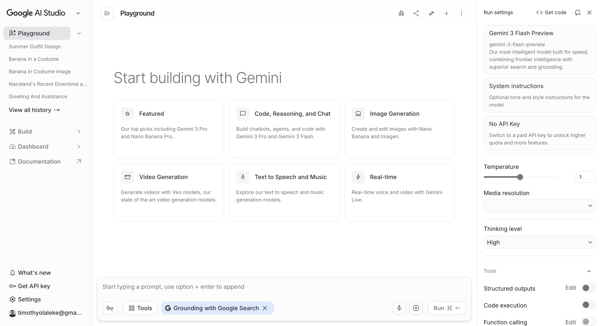
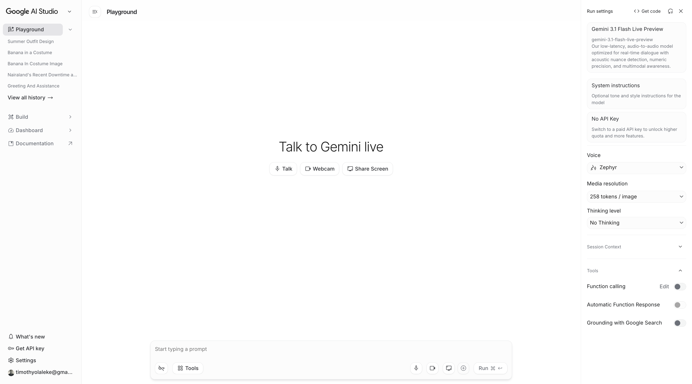
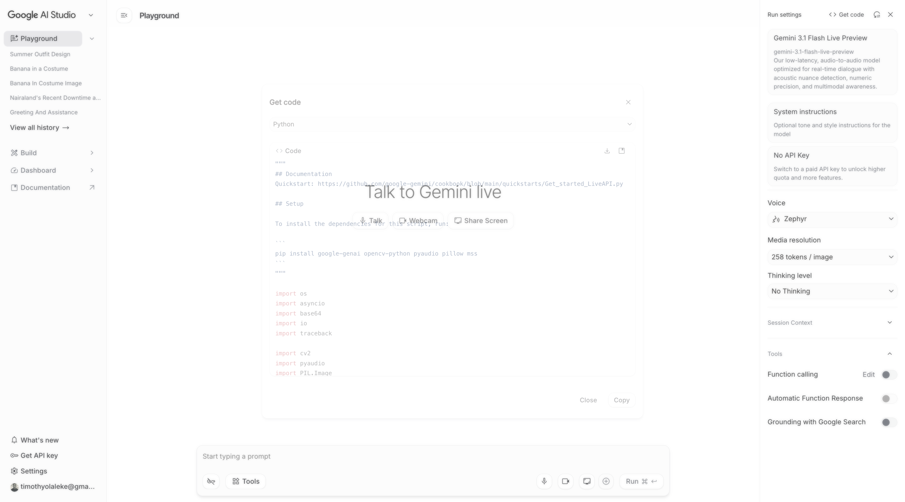
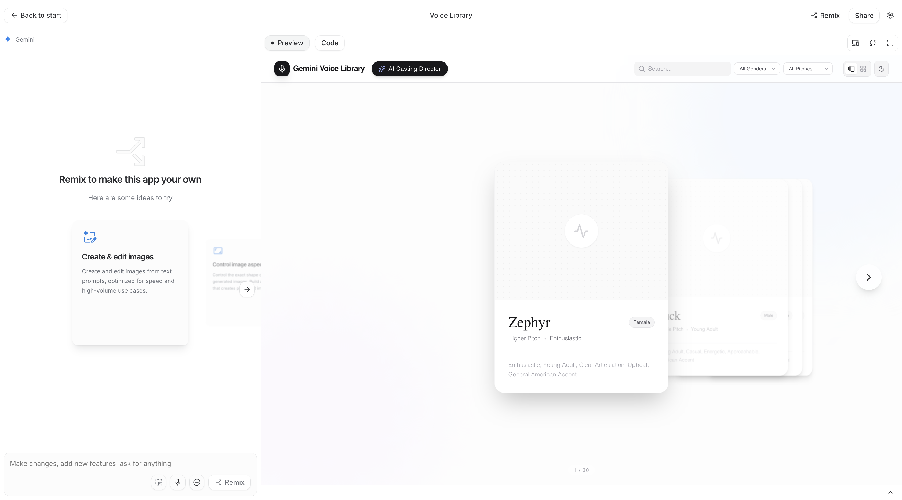

<!-- _backgroundImage: linear-gradient(135deg, #e8f0fe 0%, #d2e3fc 50%, #c6f6d5 100%) -->
<!-- _paginate: false -->

# Building Real-Time Voice AI
# with Gemini

**Timothy Olaleke**
*Google Developer Expert, Cloud*

*Build with AI Kigali -- Study Jam #2*
*March 27, 2026*

---

# Welcome Back!

### This is Study Jam **#2** of the Build with AI series.

**Last week:** We built AI agents that can think, search, and take actions.

**Today:** We teach them to **speak and listen** in real-time.

By the end of today, you'll know how to build a voice AI that talks to people -- in Swahili, French, English, or any of 90+ languages.

---

# Today's Plan

| # | What We'll Do | Time |
|---|---------------|------|
| 1 | Quick recap of Study Jam #1 | 5 min |
| 2 | What is Voice AI? | 15 min |
| 3 | Meet Gemini 3.1 Flash Live | 10 min |
| 4 | Try it: Google AI Studio | 20 min |
| 5 | Live demos: hear the AI speak | 15 min |
| | **Break** | **10 min** |
| 6 | Choose a voice & personality | 15 min |
| 7 | Voice AI for Africa | 15 min |
| 8 | What you can build | 10 min |
| 9 | Getting started, resources & Q&A | 20 min |

---

<!-- _backgroundImage: linear-gradient(135deg, #e8f0fe 0%, #d2e3fc 100%) -->

# Part 1
## Quick Recap: Study Jam #1

*What we built last week*

---

# Last Week: Our First AI Agent

### We used **Google ADK** (Agent Development Kit) to build agents that can:

- Answer questions using AI
- Convert currencies (USD to RWF)
- Calculate business metrics
- Control a web browser automatically
- Deploy to the cloud with one command

### All using Python and the **Gemini** model.

---

# What Our Agent Could Do

```
You: "What's 100 USD in Rwandan francs?"
Agent: "100 USD = 137,500 RWF"

You: "Open google.com and search for Kigali weather"
Agent: [opens Chrome, types the search, returns results]

You: "What are the top industries in Rwanda?"
Agent: "Rwanda's key industries include agriculture, tourism,
        ICT, and mining..."
```

*Impressive! But notice something...*

---

# What Was Missing?

### Everything was **text**.

- You **typed** your questions
- The agent **typed** back answers
- No voice. No conversation. No natural interaction.

### In real life:
- You don't type messages to a customer support agent -- you **call** them
- You don't text your tour guide -- you **talk** to them
- You don't write to your doctor -- you **speak** to them

### Today: we add **voice**.

---

<!-- _backgroundImage: linear-gradient(135deg, #e8f0fe 0%, #d2e3fc 100%) -->

# Part 2
## What is Voice AI?

*Something you already use every day*

---

# You Already Use Voice AI

### Think about it -- you probably used voice AI today:

| Product | Example |
|---------|---------|
| **Google Assistant** | "Hey Google, what's the weather in Kigali?" |
| **Siri** | "Hey Siri, call Mom" |
| **Alexa** | "Alexa, set a timer for 10 minutes" |
| **Google Translate** | Speak in one language, hear it in another |
| **Voice typing** | Speak instead of type on your phone |

### These all use Voice AI.
### The difference? Now **you** can build your own.

---

# How Does Voice AI Work?

### The simple version:

```
Step 1: You speak into a microphone
           🎤
Step 2: Your voice is converted to data
           🎤 → 📊
Step 3: AI understands what you said
           📊 → 🧠
Step 4: AI generates a response
           🧠 → 📝
Step 5: The response is converted to speech
           📝 → 🔊
Step 6: You hear the answer
           🔊
```

*All of this happens in less than 1 second.*

---

# The Old Way: 3 Separate Tools

### Before Gemini 3.1 Flash Live, you needed:

| Step | Tool | What It Does |
|------|------|-------------|
| 1 | **Speech-to-Text** | Convert voice → text |
| 2 | **AI Model** | Understand text → generate answer |
| 3 | **Text-to-Speech** | Convert answer → voice |

### Problems:
- Each step adds **delay** (latency)
- Three tools to **set up and pay for**
- The voice sounds **robotic**
- No real **conversation** -- just one question at a time
- The AI can't hear your **tone** or **emotion**

---

# The New Way: One Model Does Everything

### Gemini 3.1 Flash Live:

| What | How |
|------|-----|
| **Hear you** | Understands voice directly (no speech-to-text needed) |
| **Understand you** | AI processes meaning, tone, and emotion |
| **Respond** | Generates natural speech directly |
| **All at once** | Single model, single connection |

### Benefits:
- **Much faster** -- no passing between tools
- **Natural voice** -- not robotic, actual human-like speech
- **Real conversation** -- remembers context, handles interruptions
- **One tool** -- simpler to build with

---

# What Makes It Feel Real

### Gemini 3.1 Flash Live can:

- **Understand tone** -- knows if you're frustrated or happy
- **Handle interruptions** -- if you start talking, it stops and listens
- **Remember context** -- ask follow-up questions naturally
- **Filter noise** -- works even with background traffic or music
- **Speak naturally** -- pauses, emphasis, rhythm like a real person

### It's not just answering questions.
### It's having a **conversation**.

---

<!-- _backgroundImage: linear-gradient(135deg, #e8f0fe 0%, #d2e3fc 100%) -->

# Part 3
## Meet Gemini 3.1 Flash Live

*Announced 2 days ago*

---

# Gemini 3.1 Flash Live

> "This is a step change in latency, reliability and more natural-sounding dialogue, delivering the quality needed for the next generation of voice-first AI."
> -- Google, March 25, 2026

### Fast facts:
- **Model name:** `gemini-3.1-flash-live-preview`
- **Released:** March 25, 2026 (2 days ago!)
- **Languages:** 90+ including Swahili, French, Arabic
- **Voices:** 30 HD voices to choose from
- **Inputs:** text, audio, images, video
- **Status:** Preview (free to try)

---

# What's Better Than Before?

| What Improved | Details |
|--------------|---------|
| **Speed** | Much lower latency -- fewer awkward pauses |
| **Memory** | Follows conversation **2x longer** |
| **Noise** | Better at filtering background noise |
| **Emotion** | Detects frustration, confusion, excitement |
| **Instructions** | Much better at following your rules |
| **Tools** | Improved ability to call functions mid-conversation |
| **Quality** | #1 on audio benchmarks |

---

# Benchmark: Best in Class

### ComplexFuncBench Audio
**90.8%** -- the AI can call multiple tools correctly during voice conversation
*#1 among all voice AI models*

### Audio MultiChallenge
**36.1%** -- the AI handles complex instructions even with interruptions and hesitation
*#1 among all voice AI models*

> "The benchmark specifically tests complex instruction following and long-horizon reasoning amidst the interruptions and hesitations typical of real-world audio."

*This means: it works well in the real world, not just in a lab.*

---

# Who's Already Building With It?

| Company | What They Built |
|---------|----------------|
| **Verizon** | Natural voice customer support |
| **The Home Depot** | Voice-guided shopping assistance |
| **Stitch** | Voice-driven design -- talks about what it sees on screen |
| **Ato** | AI companion for elderly people (multilingual) |
| **Wit's End** | AI Game Master with theatrical voice acting |

*These launched in the last 48 hours. You're among the first in the world to learn this.*

---

# The Technology: WebSocket

### How does the "always connected" part work?

**Regular API** (like a website):
```
You send a request → wait → get a response → done.
Next question? Start over.
```

**WebSocket** (like a phone call):
```
You connect once → talk back and forth → continuous.
No waiting, no reconnecting. Just conversation.
```

### Think of it like:
- Regular API = sending **text messages** (send, wait, receive)
- WebSocket = a **phone call** (continuous, both sides talk)

---

# Audio Format (Quick Technical Note)

### Input (your microphone):
- Format: **PCM** (raw audio -- what microphones produce)
- Quality: **16,000 samples per second** (16kHz)
- Channels: **Mono** (one channel)

### Output (the AI's voice):
- Format: **PCM**
- Quality: **24,000 samples per second** (24kHz -- higher quality)
- Channels: **Mono**

*You don't need to worry about this. The SDK handles the conversion. But it's good to know what's happening.*

---

<!-- _backgroundImage: linear-gradient(135deg, #e8f0fe 0%, #d2e3fc 100%) -->

# Part 4
## Try It: Google AI Studio

*No code needed. Just talk.*

---

# What is Google AI Studio?

**AI Studio** is Google's free web tool where you can:
- Try all Gemini models
- Build and test AI apps
- Get code generated for you
- Get an API key

Think of it as a **playground** for AI -- experiment before you build.

**URL: aistudio.google.com**

---

# Step 1: Open AI Studio

Go to **aistudio.google.com** in your browser.



*You'll see different options. We want **"Real-time"** (bottom right).*

---

# Step 2: The AI Studio Home Screen

### What you see:

| Tile | What It Does |
|------|-------------|
| **Featured** | Popular models (Gemini 3 Flash, Nano Banana Pro) |
| **Code, Reasoning, and Chat** | Text-based AI -- what most people know |
| **Image Generation** | Create images with AI |
| **Video Generation** | Create videos with AI |
| **Text to Speech and Music** | Generate audio |
| **Real-time** | **This is what we want!** Voice + video with Gemini Live |

*Click on **Real-time** to open the Live playground.*

---

# Step 3: Talk to Gemini Live

This is the **Live playground** -- you can talk to Gemini right here!



*You see: Talk, Webcam, Share Screen options. The model settings are on the right.*

---

# What's On This Screen

### Left side: conversation area
- **Talk** -- use your microphone to speak
- **Webcam** -- show your camera to the AI
- **Share Screen** -- let the AI see your screen

### Right side: settings
- **Model:** Gemini 3.1 Flash Live Preview
- **System instructions:** tell the AI how to behave
- **Voice:** choose from 30 voices (default: Zephyr)
- **Thinking level:** how much the AI "thinks" before responding
- **Tools:** function calling, Google Search grounding

---

# Try It!

### Click the **Talk** button and say something:

- *"Hello, can you hear me?"*
- *"Tell me about Kigali"*
- *"What's the weather like?"*
- *"Count to 10 in French"*

### What you'll notice:
1. It responds **fast** -- almost instantly
2. It **remembers** what you said -- ask follow-up questions
3. You can **interrupt** -- start talking and it stops
4. The voice sounds **natural** -- not robotic

*This is Gemini 3.1 Flash Live in action.*

---

# Step 4: Get the Code

Here's the best part: AI Studio **writes the code for you**.
Click **"Get code"** in the top right corner:



*It shows you the Python code that does exactly what you just tried. Copy it!*

---

# What the Generated Code Looks Like

```python
import asyncio
from google import genai

client = genai.Client(api_key="YOUR_API_KEY")
model = "gemini-3.1-flash-live-preview"
config = {"response_modalities": ["AUDIO"]}

async def main():
    async with client.aio.live.connect(
        model=model, config=config
    ) as session:
        # Send a message
        await session.send_realtime_input(text="Hello!")
        # Receive the audio response
        async for response in session.receive():
            if response.server_content:
                # Audio data arrives here
                pass

asyncio.run(main())
```

*This is the foundation. Everything we demo today builds on this.*

---

# Step 5: Get Your API Key

### To run code outside AI Studio, you need an API key:

1. In AI Studio, click **"Get API key"** in the left sidebar
2. Click **"Create API key"**
3. Select your Google Cloud project (or create one)
4. Copy the key

> **Important:** Your API key is like a password.
> - Don't share it publicly
> - Don't put it in code you upload to GitHub
> - Store it as an environment variable

```bash
export GOOGLE_API_KEY="your-key-here"
```

---

# Step 6: Install the SDK

### One command to install:

```bash
pip install google-genai
```

### That's it. You now have:
- The Python SDK for Gemini
- WebSocket connection handling (automatic)
- Audio format conversion (automatic)
- All Live API features

### Verify it works:
```bash
python3 -c "import google.genai; print('Ready!')"
```

*If it prints "Ready!" -- you're good to go.*

---

<!-- _backgroundImage: linear-gradient(135deg, #e8f0fe 0%, #d2e3fc 100%) -->

# Part 5
## Live Demos: Hear the AI Speak

*Let's hear what Gemini sounds like*

---

# Demo 1: Hello Gemini

### The simplest possible demo:

We send one message: *"Hello! Say hi to the developers at Build with AI Kigali!"*

The AI responds with **actual audio** through the speakers.

> **LIVE DEMO** -- `./run.sh 1`

---

# What Just Happened?

### In that demo:

1. **Connected** to Gemini 3.1 Flash Live via WebSocket (~1 second)
2. **Sent** a text message
3. **Received** audio chunks streaming back
4. **Played** the audio through the speakers
5. **Showed** the transcript (text version of what it said)

### The audio was real speech -- not text-to-speech added after.
### Gemini **generated the voice directly**.

---

# The Code Behind Demo 1

```python
from google import genai
from google.genai import types
import os

client = genai.Client(api_key=os.environ["GOOGLE_API_KEY"])

config = types.LiveConnectConfig(
    response_modalities=[types.Modality.AUDIO],
    speech_config=types.SpeechConfig(
        voice_config=types.VoiceConfig(
            prebuilt_voice_config=types.PrebuiltVoiceConfig(
                voice_name="Puck"
            )
        )
    ),
    output_audio_transcription=types.AudioTranscriptionConfig(),
)

async with client.aio.live.connect(
    model="gemini-3.1-flash-live-preview", config=config
) as session:
    await session.send_realtime_input(text="Hello Kigali!")
    # Audio streams back automatically
```

*This is what AI Studio generates -- we just added a voice and transcription.*

---

# Demo 2: Conversation with Memory

### Three messages in one session:

```
Message 1: "My name is Timothy, I'm from Kigali"
Message 2: "I'm building a cloud platform called HostSpaceCloud"
Message 3: "What's my name and what did we discuss?"
```

### The AI should remember everything from the conversation.

> **LIVE DEMO** -- `./run.sh 3`

---

# It Remembered!

### What happened:

- **Turn 1:** AI greeted Timothy, acknowledged Kigali
- **Turn 2:** AI gave suggestions for the cloud platform
- **Turn 3:** AI recalled his name, his location, and HostSpaceCloud

### Why this matters:
A single WebSocket session maintains **full conversational context**.
No need to repeat yourself. No need to resend history.

### This is what makes voice AI feel natural.
You talk to it like a person, and it **remembers** like a person.

---

<!-- _backgroundImage: linear-gradient(135deg, #e8f0fe 0%, #c6f6d5 100%) -->

# Break -- 10 minutes

### While you wait, try it yourself:

**aistudio.google.com/live**

*Open on your phone or laptop. Click Talk. Say hello!*

---

<!-- _backgroundImage: linear-gradient(135deg, #e8f0fe 0%, #d2e3fc 100%) -->

# Part 6
## Choose a Voice & Personality

*30 voices. Infinite personalities.*

---

# 30 HD Voices Available

### AI Studio has a **Voice Library** where you can preview every voice:



*Go to: **aistudio.google.com/apps/bundled/voice-library***
*Click play on any voice to hear a sample.*

---

# Voice Gallery

| Voice | Personality | Best For |
|-------|------------|----------|
| **Puck** | Upbeat, energetic | Chatbots, fun apps |
| **Charon** | Calm, informative | Education, support |
| **Kore** | Firm, clear | Business, professional |
| **Aoede** | Breezy, light | Casual conversation |
| **Sulafat** | Warm | Healthcare, care apps |
| **Fenrir** | Excitable | Games, entertainment |
| **Zephyr** | Bright | General purpose |

*Plus 23 more: Achird, Gacrux, Sadachbia, Leda, Orus...*

---

# Demo 3: Hear the Difference

### Same message, **4 different voices**.

The AI says the same thing in each voice -- listen to how different they sound:

1. **Puck** (upbeat)
2. **Charon** (calm)
3. **Kore** (firm)
4. **Aoede** (breezy)

> **LIVE DEMO** -- `./run.sh 2`

*Which one did you like best?*

---

# Choosing the Right Voice

### Match the voice to your use case:

| Your App | Recommended Voice | Why |
|----------|------------------|-----|
| Customer support | **Achird** or **Charon** | Friendly yet professional |
| Education/tutoring | **Puck** or **Sulafat** | Encouraging and warm |
| Healthcare | **Sulafat** or **Charon** | Warm and calming |
| Banking/finance | **Kore** or **Orus** | Firm and trustworthy |
| Games/entertainment | **Fenrir** or **Sadachbia** | Exciting and fun |
| Tour guide | **Aoede** or **Puck** | Light and engaging |

### Or change the voice in AI Studio's dropdown -- try them all!

---

# How to Set a Voice in Code

```python
config = types.LiveConnectConfig(
    response_modalities=[types.Modality.AUDIO],
    speech_config=types.SpeechConfig(
        voice_config=types.VoiceConfig(
            prebuilt_voice_config=types.PrebuiltVoiceConfig(
                voice_name="Kore"  # Change this!
            )
        )
    ),
)
```

### Change `"Kore"` to any voice name:
`Puck` | `Charon` | `Kore` | `Aoede` | `Sulafat` | `Fenrir` | `Achird` | `Zephyr` | `Gacrux` | `Leda` | `Orus` | ... and 19 more

---

# Give It a Personality

**Voice** = how it sounds. **System instruction** = what it says and how it behaves.

```python
system_instruction = """You are Amani, a friendly Kigali tour guide.
Keep responses short -- 1-2 sentences. Suggest a place to visit."""
```

### Match personality to use case:

| Name | Role | Voice |
|------|------|-------|
| **Amani** | Kigali tour guide | Aoede (breezy) |
| **Dr. Sarah** | Health assistant | Sulafat (warm) |
| **Coach K** | Study tutor | Puck (upbeat) |
| **Alex** | Banking assistant | Kore (firm) |

---

# Setting the System Instruction

### In AI Studio:
Just type it in the **"System instructions"** box on the right panel.

### In code:
```python
config = types.LiveConnectConfig(
    response_modalities=[types.Modality.AUDIO],
    system_instruction=types.Content(
        parts=[types.Part(text="You are Amani, a friendly Kigali tour guide...")]
    ),
    speech_config=types.SpeechConfig(
        voice_config=types.VoiceConfig(
            prebuilt_voice_config=types.PrebuiltVoiceConfig(voice_name="Aoede")
        )
    ),
)
```

---

# Transcription: See What's Being Said

### Turn voice into text -- for both sides of the conversation.

```python
config = types.LiveConnectConfig(
    response_modalities=[types.Modality.AUDIO],
    # See text of what the AI says
    output_audio_transcription=types.AudioTranscriptionConfig(),
    # See text of what the user says
    input_audio_transcription=types.AudioTranscriptionConfig(),
)
```

### Why you need this:
- **Accessibility** -- display captions for hearing-impaired users
- **Record keeping** -- save transcripts of conversations
- **Search** -- find specific moments in past conversations
- **Debugging** -- see exactly what was said when testing

---

<!-- _backgroundImage: linear-gradient(135deg, #e8f0fe 0%, #d2e3fc 100%) -->

# Part 7
## Voice AI for Africa

*The biggest opportunity you'll see this year*

---

# Africa Is Voice-First

### Why voice matters more here than anywhere:

- **1.4 billion people** across the continent
- **Mobile-first** -- most access the internet on phones
- **500+ languages** spoken daily
- **Code-switching** -- people mix languages naturally
- **Voice is universal** -- works regardless of literacy level

### Voice AI isn't a nice-to-have in Africa.
### It's the **most natural** way to interact with technology.

---

# Languages Gemini Speaks

### Out of 90+ supported languages, these matter for Africa:

| Language | Where It's Spoken |
|----------|------------------|
| **Swahili** | East Africa (Kenya, Tanzania, Uganda, DRC, Rwanda) |
| **Amharic** | Ethiopia |
| **Afrikaans** | South Africa |
| **Zulu** | South Africa |
| **French** | West/Central Africa (20+ countries) |
| **Arabic** | North Africa |
| **Portuguese** | Mozambique, Angola, Cape Verde |
| **English** | Pan-African |

*These cover the majority of Africa's population.*

---

# Use Cases for East Africa

| Problem Today | Voice AI Solution |
|---------------|------------------|
| Patients can't describe symptoms in English | **Voice intake** in Kinyarwanda or Swahili |
| Farmers don't know market prices | **Ask by voice**: "Price of maize today?" |
| Banking confusing on small screens | **Voice banking**: "Send 5000 francs to Jean" |
| Students struggle without tutors | **AI tutor** that speaks their language |
| No 24/7 support | **Voice agents** that answer calls anytime |

---

# Real Challenges

> "Building voice bots for places like Nigeria is very different -- accents vary, languages are mixed, network quality is uneven, and user behavior is unpredictable."

### Things to plan for when building for Africa:

| Challenge | What It Means |
|-----------|--------------|
| **Accents** | Kigali French ≠ Paris French ≠ Dakar French |
| **Code-mixing** | "Ndashaka kumenya price ya avocado" (Kinyarwanda + English) |
| **Network drops** | What happens when connection is lost mid-sentence? |
| **Cost** | Users are cost-sensitive -- optimize for affordability |
| **Noise & "who speaks first?"** | Busy markets, moto traffic; agent should greet first |

---

# Good News: Gemini Handles Most of This

### Built-in features that help:

- **Noise filtering** -- 3.1 Flash Live is specifically better at background noise
- **Accent understanding** -- trained on diverse global speech
- **Code-switching** -- understands mixed-language input
- **Interruption handling** -- if the user talks, it stops and listens
- **Low latency** -- works even on slower connections

### What you still need to design:
- Graceful **fallback** when connection drops
- **Cost monitoring** to stay within budget
- **User experience** for first-time voice AI users

---

# Companies Already Building Voice AI

| Company | What They Built |
|---------|----------------|
| **Verizon** | Natural voice customer support at scale |
| **The Home Depot** | Voice-guided shopping -- ask about products |
| **Stitch** | Design tool -- AI talks about what it sees on screen |
| **Ato** | Multilingual companion for elderly people |

---

# Partner Platforms

### Making it easier to build voice AI:

| Platform | What It Offers |
|----------|---------------|
| **LiveKit** | Add voice AI to any app (handles WebRTC) |
| **Pipecat by Daily** | Build voice chatbots quickly |
| **Firebase** | Voice AI with Google's backend |
| **Fishjam** | Live video/audio streaming |

---

# The Opportunity

### Think about this:

- The model was released **2 days ago**
- It supports **African languages natively**
- There's a **free tier** for testing
- Almost **no one** has built voice AI for African markets yet

### If you build a voice AI for healthcare, farming, education, or banking in East Africa...

### You could serve **400+ million people** in this region.

---

<!-- _backgroundImage: linear-gradient(135deg, #e8f0fe 0%, #d2e3fc 100%) -->

# Part 8
## What You Can Build

*Project ideas for every skill level*

---

# Starter Projects (This Weekend)

### If you're just getting started:

| Project | What It Does | Difficulty |
|---------|-------------|------------|
| **Voice Journal** | Speak your thoughts, AI organizes them | Easy |
| **Language Buddy** | Practice conversation in a new language | Easy |
| **Trivia Bot** | AI asks questions aloud, you answer | Easy |
| **Motivational Coach** | Daily pep talks with a warm voice | Easy |
| **Voice Calculator** | "What's 15% of 47,000?" -- hears the answer | Easy |

*Each of these can be built with the code from today's demos.*

---

# Medium Projects (1-2 Weeks)

### Ready for more?

| Project | What It Does | Why It's Useful |
|---------|-------------|----------------|
| **Kigali Tour Guide** | Voice assistant about Rwanda | Tourism |
| **Customer Support Bot** | Answers calls for your business | Any business |
| **Study Helper** | Reads questions, checks answers | Education |
| **Recipe Assistant** | Hands-free cooking instructions | Practical |
| **Appointment Booking** | "Book me for Tuesday at 3pm" | Healthcare |

---

# Advanced Projects (Build a Startup)

### Real business opportunities:

| Project | Market | Potential |
|---------|--------|----------|
| **Medical Intake** | Patients describe symptoms by voice | Healthcare |
| **Voice Commerce** | "I need 5 kg of rice" -- orders by phone | E-commerce |
| **Meeting Assistant** | Joins calls, takes notes, answers questions | Enterprise |
| **Farm Advisory** | Crop prices, weather, pest advice by voice | Agriculture |
| **Voice KYC** | Bank account opening by voice conversation | Fintech |
| **Accessibility Tool** | Describes the screen for visually impaired | Social impact |

---

# Demo 4: You Talk, AI Responds

### Let's build something together right now!

**You tell me what to ask.** Shout out a question, a topic, or a scenario.
I'll type it, we'll all hear the AI respond through the speakers.

> **LIVE DEMO** -- `./run.sh 4`

*Ideas: Ask about Kigali, ask it to tell a joke, ask it to explain something, ask it to be a character...*

---

# What Makes a Good Voice AI App?

### 5 principles to remember:

| Principle | Why |
|-----------|-----|
| **Keep responses short** | Nobody wants to listen to a 5-minute answer |
| **Be clear about what it can do** | "I can help with X, Y, and Z" |
| **Handle errors gracefully** | "I didn't catch that, could you repeat?" |
| **Choose the right voice** | Match voice to personality and use case |
| **Test with real users** | Your friends and family, not just yourself |

---

<!-- _backgroundImage: linear-gradient(135deg, #e8f0fe 0%, #d2e3fc 100%) -->

# Part 9
## Getting Started

*Everything you need to build your first voice AI*

---

# 3 Steps to Your First Voice AI

### Step 1: Get an API key
Go to **aistudio.google.com** → click **"Get API key"** → create one

### Step 2: Install the SDK
```bash
pip install google-genai
```

### Step 3: Try it in AI Studio
Go to **aistudio.google.com/live** → click Talk → start speaking!

### Ready to code?
Click **"Get code"** in AI Studio. It generates the Python for you.
Copy it, paste it, run it. Done.

---

# The Complete Stack

| Layer | What It Is | What You Do |
|-------|-----------|-------------|
| **Model** | Gemini 3.1 Flash Live | Just put the name in your config |
| **SDK** | `google-genai` Python package | `pip install google-genai` |
| **Connection** | WebSocket | SDK handles this automatically |
| **Audio** | PCM format | SDK handles this automatically |
| **AI Studio** | Web playground | Test everything here first |
| **ADK** | Agent Development Kit | Add tools + memory (Study Jam #1) |
| **Cloud Run** | Deployment | Put your app online (Study Jam #1) |

*Most of the hard work is handled by the SDK. You focus on your idea.*

---

# Putting It Together: ADK + Voice

### Remember ADK from last week? You can combine them:

| Study Jam #1 (ADK) | Study Jam #2 (Voice) | Together |
|--------------------|---------------------|---------|
| Text agents | Voice agents | Voice agents with tools |
| Custom tools | Audio streaming | Tools called by voice |
| Sessions/memory | Conversation context | Persistent voice assistant |
| Cloud Run deploy | WebSocket connection | Deployed voice agent |

### Example:
*"What's 100 dollars in Rwandan francs?"*
→ Voice AI hears → calls `convert_currency` tool → speaks the answer

*The tools from last week + the voice from today = a complete agent.*

---

# Important Limits to Know

| What | Limit |
|------|-------|
| **Session length** | 15 min per connection (can reconnect) |
| **Context window** | 128K tokens of conversation memory |
| **Response type** | Text **OR** Audio (choose one per session) |
| **Voices / Languages** | 30 HD voices, 90+ languages |
| **Free tier** | Available for testing and prototyping |

### Tips:
- **Use headphones** when testing with mic (prevents echo)
- **Start in AI Studio** before writing code
- **Start simple** -- get "Hello" working first, then add features

---

# Resources: Everything You Need

| Resource | Where To Find It |
|----------|-----------------|
| **Get API Key** | aistudio.google.com |
| **Try Voice AI Live** | aistudio.google.com/live |
| **All 30 Voices** | aistudio.google.com/apps/bundled/voice-library |
| **Live API Docs** | ai.google.dev/gemini-api/docs/live |
| **Code Examples** | github.com/google-gemini/gemini-live-api-examples |
| **Today's Code + Slides** | github.com/Timtech4u/build-with-ai-kigali |
| **Google ADK** | google.github.io/adk-docs |

---

# Recommended Next Steps

### Start today:
1. Get your **API key** from AI Studio
2. **Try the Live playground** -- just talk to it
3. **Preview the voices** -- pick your favorite
4. **Copy the code** from "Get code" and run it locally

### Keep going:
5. Build your first **voice app** -- pick a project from the ideas list
6. Add **custom tools** (from Study Jam #1)
7. Share what you built with the **GDG community**

---

# What We Learned Today

### Study Jam #1 (last week):
- Built agents that can **think and act** with tools
- **Deployed** to the cloud

### Study Jam #2 (today):
- Made agents **speak and listen** in real-time
- Tried it in **AI Studio** -- no code needed
- Heard **30 different voices**, learned about **Voice AI for Africa**
- Combined **voice + tools** for complete agents

### Key message:
**You don't need to be an expert to build voice AI.**
**AI Studio generates the code. You bring the idea.**

---

<!-- _backgroundImage: linear-gradient(135deg, #e8f0fe 0%, #d2e3fc 50%, #c6f6d5 100%) -->
<!-- _paginate: false -->

# Thank You!

## Timothy Olaleke
**Google Developer Expert, Cloud**

*Get your API key at **aistudio.google.com***
*Start building voice agents today!*

**@timtech4u** | **github.com/Timtech4u**

*GDG Cloud Kigali -- Build with AI 2026*

---

<!-- _backgroundImage: linear-gradient(135deg, #e8f0fe 0%, #d2e3fc 100%) -->
<!-- _paginate: false -->

# Q&A

*Ask anything about Voice AI, Gemini, ADK, or building with AI!*

**Links to remember:**
aistudio.google.com | ai.google.dev | github.com/Timtech4u

